# Electrical Load Analysis: A Strategic Deep Dive

> **Objective:** To develop a high-precision forecasting model by understanding the physical and statistical nature of the electrical grid's behavior.

---

## 1. Executive Summary

Our analysis of the substation telemetry data reveals that we are not just dealing with random numbers, but with **physical power flow**. The dataset is high-quality and forecastable, provided we respect its intricate structure.

*   **The Target:** We are predicting "Community Load" (The sum of transformers T3, T4, and T1).
*   **The Challenge:** The grid operates in distinct "regimes" (Normal, Seasonal Shift, Transitions).
*   **The Strategy:** A simple regression will fail. We need a model that uses **Seasonality (24h Lags)**, **Leading Indicators (Source Flow)**, and **Regime Awareness**.

---

## 2. Phase 1: Data Truth & Physics (Getting the Foundation Right)

Before running any models, we established the "actual Ground Truth" of our data.

### The Landscape of Missingness
Data quality is the ceiling of performance.

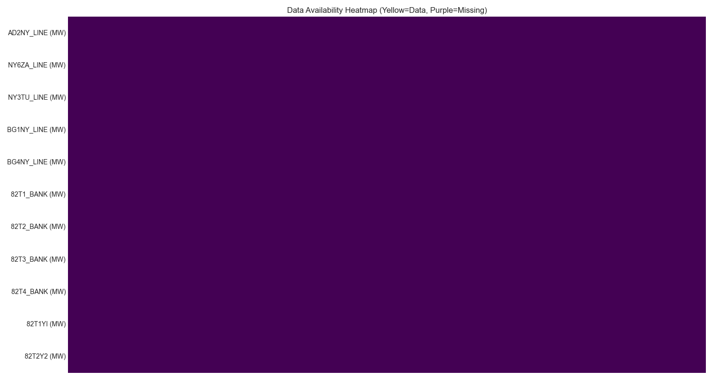
*Figure 1: Heatmap showing location of missing values (White). The data is >99% complete.*

### Validating Physics: Flow Conservation
Does Energy In = Energy Out? We checked the substation balance.

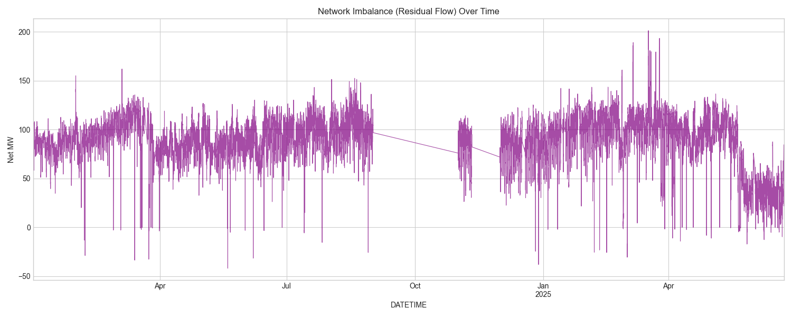
*Figure 2: Net Imbalance (Inflow - Outflow). Large spikes indicate metering errors or topology changes.*

### Understanding Flow Direction
We confirmed the physical meaning of "Positive" vs "Negative" values.

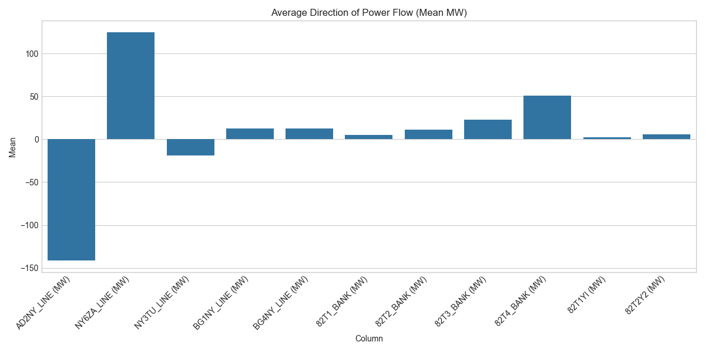
*Figure 3: Mean value of each line. T2_BANK is consistently negative (Generation).*

> [!NOTE]
> **Technical Note: Telemetry Sign Convention**
> **Positive (+)** = Import (Load). **Negative (-)** = Export (Generation/Backfeed).

### Data Distribution & Outliers
We used box plots to understand the spread and stability of every line.

*Figure 4: Distribution of all telemetry channels.*

---

## 3. Phase 2: Time Structure (The Rhythms of the Grid)

### The Seasonal Drift
The load "breathes" with the seasons.

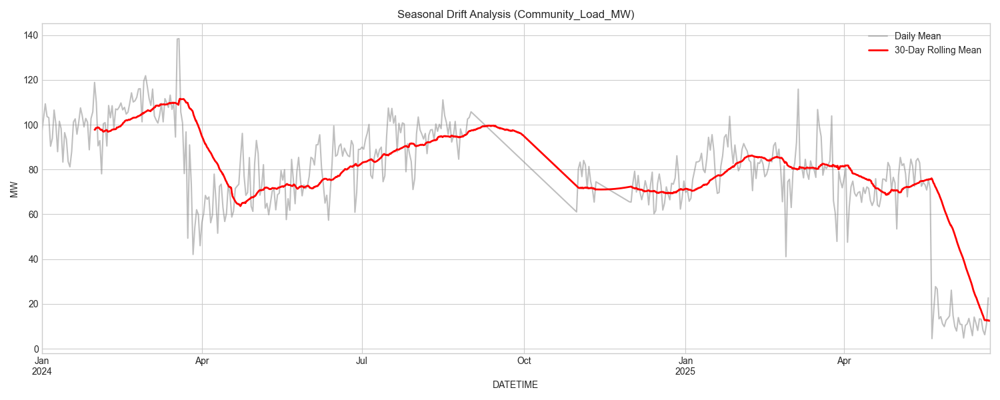
*Figure 5: Monthly distribution of load. Note the massive shift from June to August.*

### Intraday Stability
How "standard" is a day within each month?

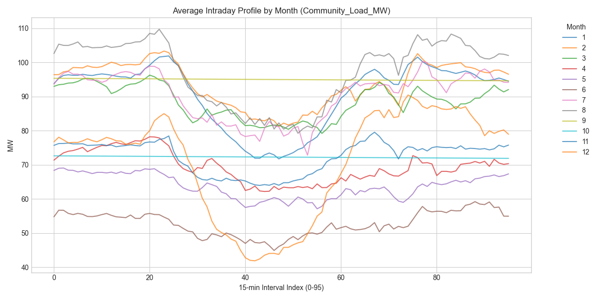
*Figure 6: Daily profiles plotted by month. Summer months show tighter, more consistent high-load profiles.*

### The "Weekend Effect" Myth
We tested if weekends differ from weekdays.

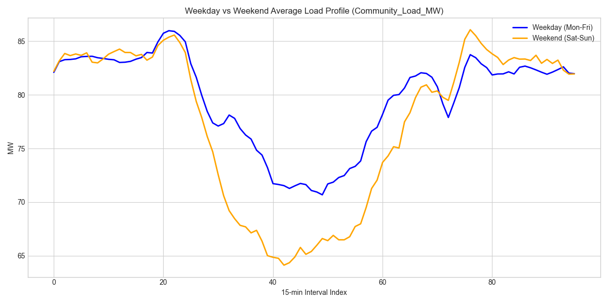
*Figure 7: Average Weekday vs Weekend Profile.*

*Figure 8: Boxplot showing the statistical difference is minimal (< 3%).*

### Memory & Persistence (ACF/PACF)
How much does the past predict the future?

**Community Load (Target):**
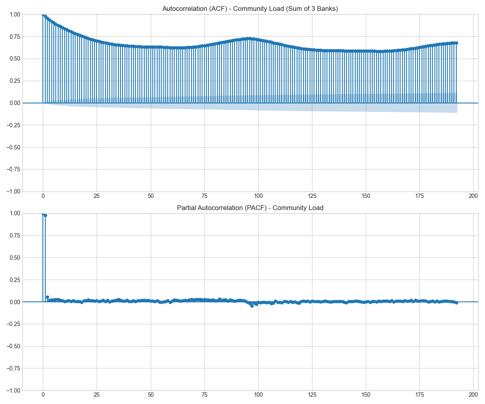
*Figure 9: ACF/PACF for Target. Lag 96 (24h) is the dominant seasonal peak.*

**System Total Load (Check):**

*Figure 10: Comparison for total system load.*

---

## 4. Phase 3: Regime Behavior (Operating Modes)

The grid switches between different "Operating States".

### Identifying the Modes (Clusters)
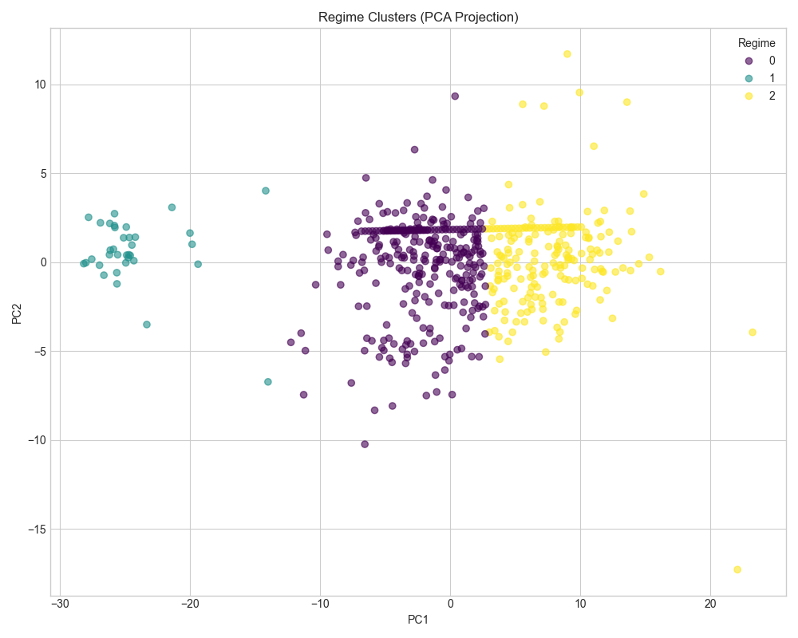
*Figure 11: Daily load profiles projected into 2D space (PCA), colored by Cluster ID.*

### The Shape of Usage
What do these regimes look like?

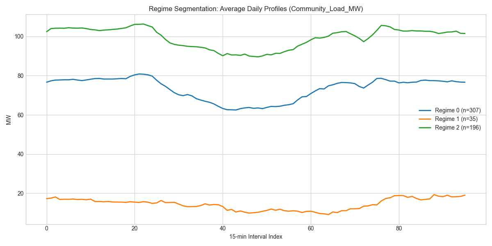
*Figure 12: The average daily shape of each Regime (0=Standard, 1=Transition, 2=Seasonal).*

### Event Detection (Fingerprinting)
We looked for extreme events.

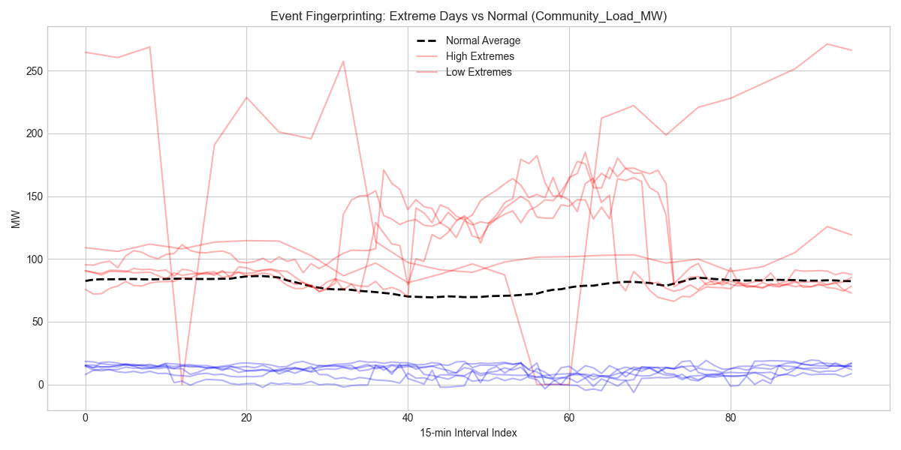
*Figure 13: Analysis of specific anomalous days (e.g., partial blackouts or extreme heat).*

---

## 5. Phase 4: Network Dependence (Causality)

No substation is an island.

### Lead-Lag Dynamics
Does the Incomer (NY6ZA) predict the Load?

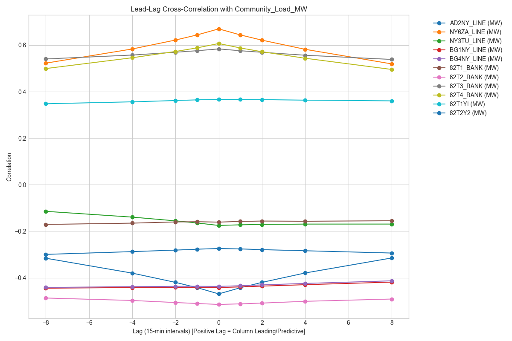
*Figure 14: Cross-correlation at different lags. NY6ZA leads the load changes.*

**Incomer Line (NY6ZA) Structure:**
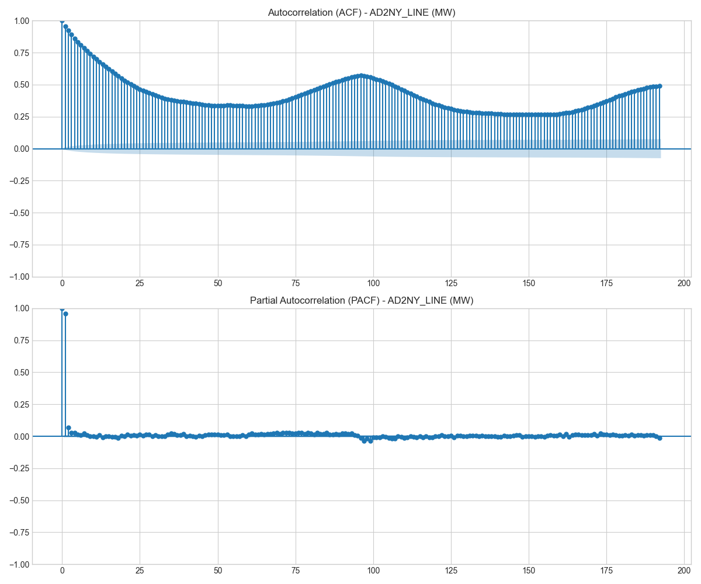
*Figure 15: Autocorrelation of the inflow line. It is more volatile than the load itself.*

### System Redundancy
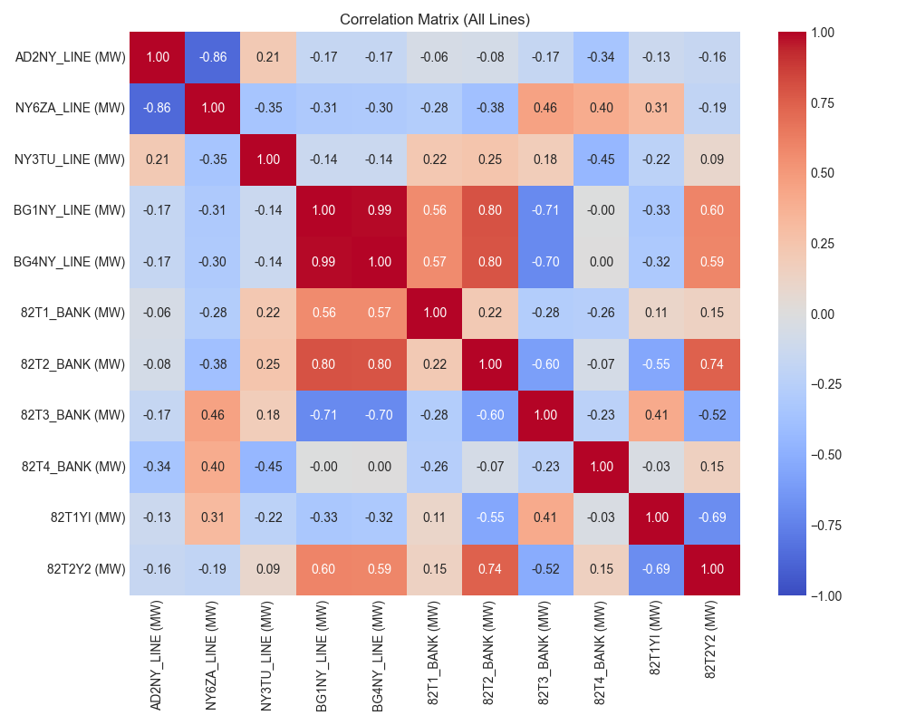
*Figure 16: Correlation Heatmap of all 11 lines.*

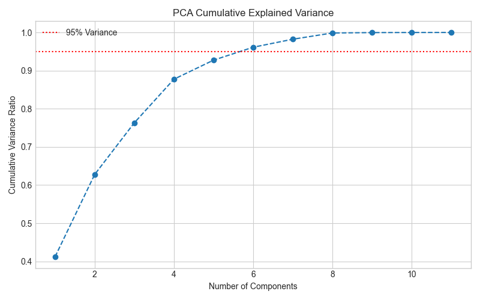
*Figure 17: PCA Cumulative Variance. 95% of information is in the first few components.*

---

## 6. Phase 5: Forecastability limits

### The "Speed Limit"
Where is the model most likely to fail?

*Figure 18: Standard deviation of load by hour. 14:00-16:00 is the most volatile window.*

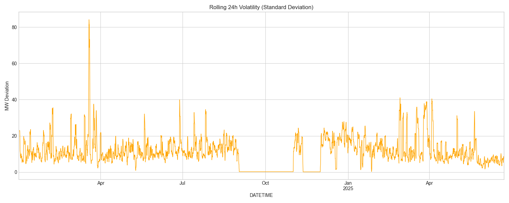
*Figure 19: Volatility over time. Spikes indicate unstable grid periods.*

### Prediction Horizon
How far ahead can we accurately predict?

*Figure 20: Auto-correlation decay over time. Accuracy drops significantly after 24 hours.*

---

## 7. Phase 6 & 7: Targets & Benchmarks

### Defining the Target
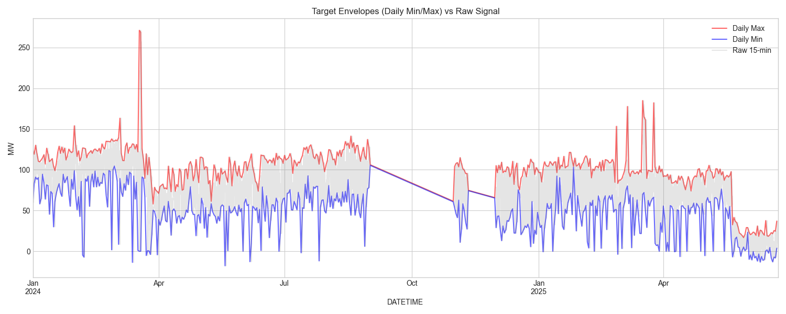
*Figure 21: Daily Min/Max envelopes vs Mean Load. The Peak is often more stable than the average.*

### Benchmarking
We must beat the simple baselines.

*Figure 22: Comparison of Model MAE against Persistence and Seasonal Naive baselines.*

---

## 8. Feature Engineering Strategy: The "Why" and "What"

We don't just throw data at a model. We select features based on Physics and Statistics.

### 1. The "Must-Haves" (High Importance)
*   **`Lag_96` (The Seasonal Memory)**
    *   *Why?* The ACF plots prove that what happened yesterday at this exact time is the best predictor for today. It captures the daily human cycle.
*   **`NY6ZA_Flow` (The Leading Indicator)**
    *   *Why?* It correlates strongly and *leads* the target. It's like seeing water flow into a pipe before it reaches the tap.
*   **`Hour_of_Day` (Cyclic)**
    *   *Why?* Encodes the fundamental daily rhythm (people wake up, work, sleep).

### 2. The "Nice-to-Haves" (Context)
*   **`Month_of_Year`**
    *   *Why?* Captures the massive seasonal drift we saw in Phase 2.
*   **`Rolling_Mean_24h`**
    *   *Why?* Smooths out noise and gives the model a baseline "trend" level.

### 3. The "Drop" List (Redundant/Dangerous)
*   **`T2_Flow` (Negative)**: It's generation, not load. Unless we treat it explicitly as a negative feature, it confuses the definition of "Demand."
*   **`Date`**: Raw dates don't repeat. Models can't learn from them. We extract components (Day/Month) instead.

---

## Appendix: Glossary of Terms

| Term | Definition |
| :--- | :--- |
| **ACF (Autocorrelation Function)** | A plot showing how much a signal correlates with its past self. High bars at Lag 96 mean "history repeats daily." |
| **PACF (Partial ACF)** | Shows the "pure" correlation at a lag, removing indirect effects. It tells us how many past steps actually matter. |
| **Stationarity** | A stable statistical state. Most ML models assume this. Our data is *not* stationary, so we must use Lags (Differencing) to fix it. |
| **Telemetry** | Remote measurement data. |
| **Regime** | A distinct mode of operation. The grid acts differently on a "Heatwave" day vs. a "Mild" day. |
