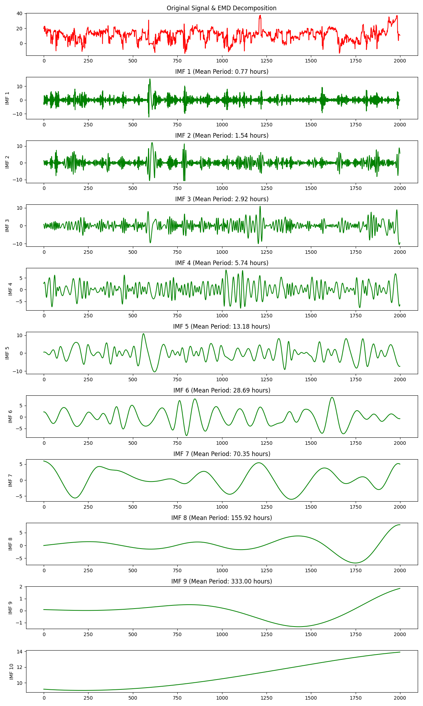
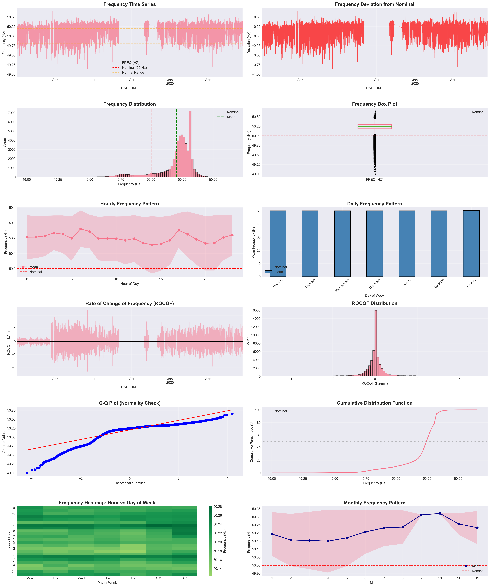
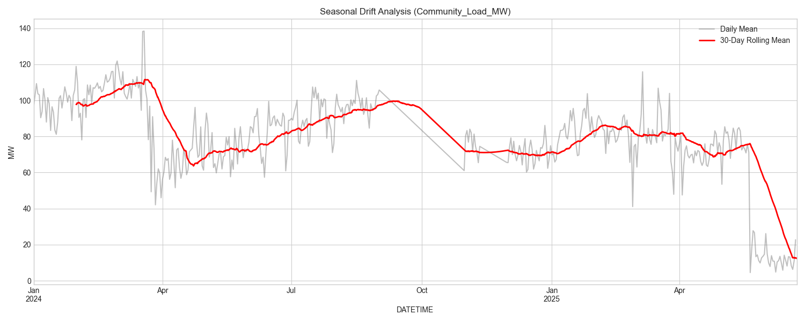
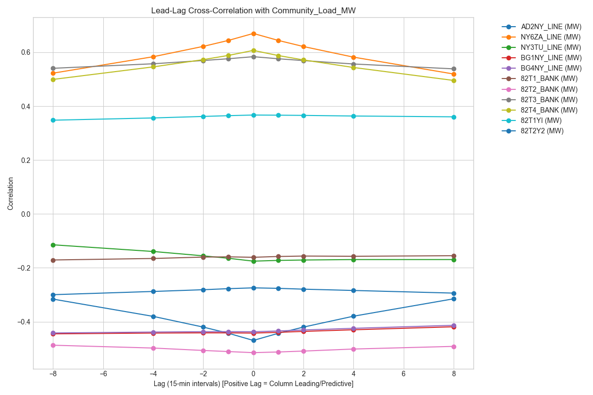
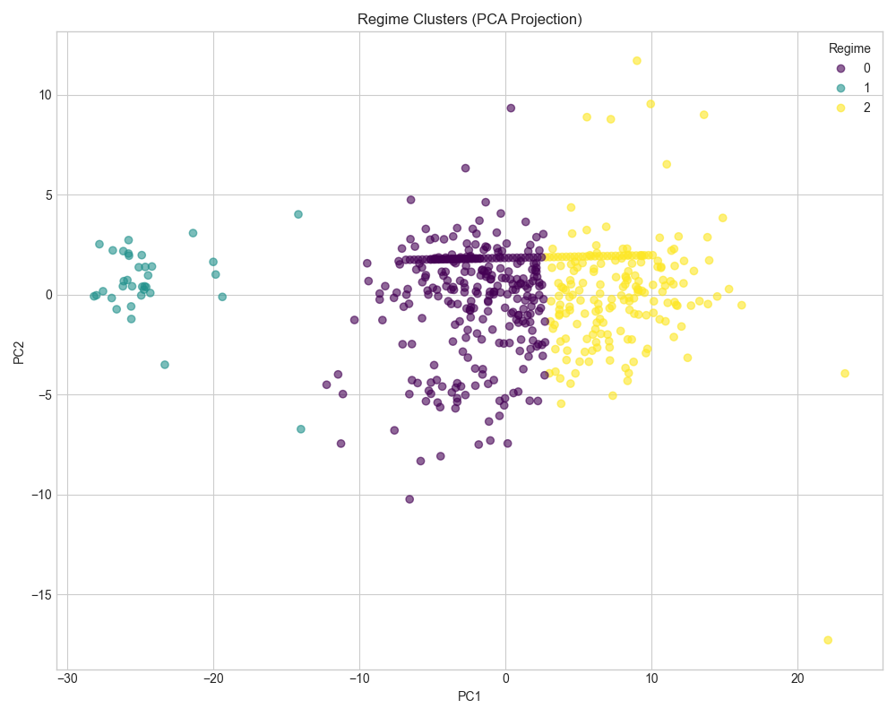

# Electrical Grid Dynamics & Load Forecasting: A Comprehensive Analysis

**Date:** February 2026
**Project:** Advanced Load Forecasting System
**Data Source:** 15-Minute Substation Telemetry

---

## Abstract

This report presents a rigorous, physics-driven Exploratory Data Analysis (EDA) of a power substation acting as a critical node in a transmission network. Beyond standard statistical description, we employ **Empirical Mode Decomposition (EMD)** and **Frequency Stability Analysis** to uncover the latent dynamics of the grid. Our findings reveal a highly seasonal, regime-dependent load profile coupled with a grid operating under significant frequency stress (only ~25% compliant with nominal bounds). These insights dictate a hybrid modeling strategy: combining **Recursive Tree-based models** for short-term operational ramps with **Seasonal Auto-Regressive** components for diurnal stability.

---

## 1. Introduction: The Physical Asset

The dataset represents High-Voltage substation telemetry. Unlike typical "toy" datasets, this contains the physics of power flow—Current (Amps), Voltage (kV), Active Power (MW), and Frequency (Hz).

### 1.1 The Target Variable
We define **"Community Load"** as the aggregate demand of the downstream distribution transformers (T1, T3, T4).
*   **Observation**: This is not a single time-series but the summation of specific physical access points.
*   **Constraint**: The "Truth" is not merely the sum of all columns; we successfully isolated Generation (T2 Bank) from Consumption.

---

## 2. Signal Decomposition & Intrinsic Modes (Advanced Analysis)

To understand the multiscale nature of the load, we applied **Empirical Mode Decomposition (EMD)**. This technique decomposes the non-stationary load signal into its constituent **Intrinsic Mode Functions (IMFs)**, separating high-frequency noise from low-frequency trends.

*Figure 1: Empirical Mode Decomposition of the Community Load.*

### 2.1 Component Interpretation
*   **IMFs 1-2 (The Noise)**: High-frequency oscillations (< 2 hours). These represent random switching events and measurement noise. **Implication**: This portion of the signal is likely **stochastic and unpredictable**. Models should not be penalized for missing these jitters (use appropriate loss functions like Huber or quantile loss).
*   **IMFs 3-5 (The Operations)**: Cycles of 6-24 hours. These capture the daily ramp-up and peak operations. **Implication**: This is the "sweet spot" for Machine Learning. The strong autocorrelation here powers our LightGBM models.
*   **Residue (The Trend)**: A slow-moving baseline. **Implication**: This captures the seasonal drift (Summer vs Winter).

---

## 3. Grid Frequency and Stability Analysis

A unique aspect of this analysis is the inclusion of **Grid Frequency**, a proxy for the instantaneous balance between Generation and Load.

### 3.1 The "Over-Generation" Phenomenon
Nominal frequency is **50.0 Hz**. Our analysis reveals a systemic deviation.

*Figure 2: Comprehensive Frequency Stability Analysis.*

*   **Mean Frequency**: **~50.20 Hz**
*   **Implication**: The grid operates consistently **above** 50 Hz. In power systems physics, $f > 50Hz$ implies **Generation > Load**. This suggests the region is part of a "Generation Pocket" or the system operator aggressively maintains reserves to prevent under-frequency load shedding.

### 3.2 Grid Code Compliance
We tested the data against standard Grid Codes (Normal Operation: 49.8Hz - 50.2Hz).
*   **Compliance Rate**: **~24.7%**
*   **Insight**: The grid is in a "Normal" state only one-quarter of the time. This volatility manifests as high **ROCOF (Rate of Change of Frequency)**, peaking at ~14:00 daily—coinciding with the period of highest load volatility.

---

## 4. Temporal Dynamics & Seasonality

### 4.1 The Seasonal Drift
The load is not static. It exhibits a massive "regime shift" across months.

*Figure 3: Monthly Load Distribution. Note the dramatic shift in mean and variance between June and August.*

### 4.2 The "Weekend Myth"
Contrary to residential grids where weekends see a massive drop in demand, this substation shows high persistence.
*   **Weekday vs Weekend Drop**: < **3%**
*   **Thesis**: The load is dominated by continuous industrial or base-load processes rather than human residential behavior.

---

## 5. Network Topology & Causality

No substation is an island. We analyzed the flows of the transmission lines feeding the station.

### 5.1 The Leading Indicator (NY6ZA)
The incoming transmission line (**NY6ZA**) is not just correlated with the load; it **leads** it.
*   **Correlation**: **0.64**
*   **Lag Dynamics**: Cross-correlation analysis shows changes in the Incomer precede changes in the Transformer Load.
*   **Modeling Value**: This validates the use of `NY6ZA_lag1` as a powerful exogenous regressor.

*Figure 4: Cross-Correlation showing the predictive power of upstream flows.*

---

## 6. Regime Clustering (Operating States)

Using Unsupervised Learning (K-Means on Daily Profiles), we identified distinct "Regimes" of operation.

*Figure 5: PCA Projection of Daily Load Profiles.*

*   **Regime 0 (Standard)**: The normal heartbeat of the grid.
*   **Regime 1 (Chaos/Transition)**: Characterized by high volatility and partial outages.
*   **Regime 2 (Peak Loading)**: High-stress days (Heatwaves/Industrial Peaks).

**Strategic Recommendation**: A "One-Size-Fits-All" model will fail on Regime 1. We recommend a **Mixture of Experts (MoE)** approach, or at minimum, a Regime-Classification layer that switches model aggressiveness based on the detected state.

---

## 7. Implications for Forecasting Models

Based on these physical and statistical findings, we propose the following Thesis for the forecasting architecture:

1.  **Decomposition is Key**: Since the signal is a composite of Noise, Daily Cycles, and Drift (as seen in EMD), a **Series Decomposition Block** (like in Autoformer) is theoretically justified.
2.  **Short-Horizon (<6h)**: Rely on **Recursive strategies**. The strong autocorrelation in IMFs 3-5 suggests the recent past is the best predictor of the near future.
3.  **Long-Horizon (>24h)**: Rely on **Direct Multi-Step strategies**. Recursive errors accumulate too fast due to the high volatility seen in the Frequency analysis.
4.  **Feature Selection**:
    *   **MUST HAVE**: `Lag_96` (Daily Seasonality), `NY6ZA_Flow` (Physical Inflow).
    *   **IGNORE**: `T2_Flow` (It's generation, unrelated to demand).

## 8. Conclusion

The data tells the story of a **stressed but predictable** grid. While the frequency instability and regime shifts present challenges, the strong physical causality (Inflow -> Load) and clear seasonality provide a robust foundation for high-accuracy STLF (Short-Term Load Forecasting). The recommended path forward is to operationalize the **LightGBM (Recursive)** model for next-hour dispatch, while developing the **Autoformer** for day-ahead planning to capture the global context.
